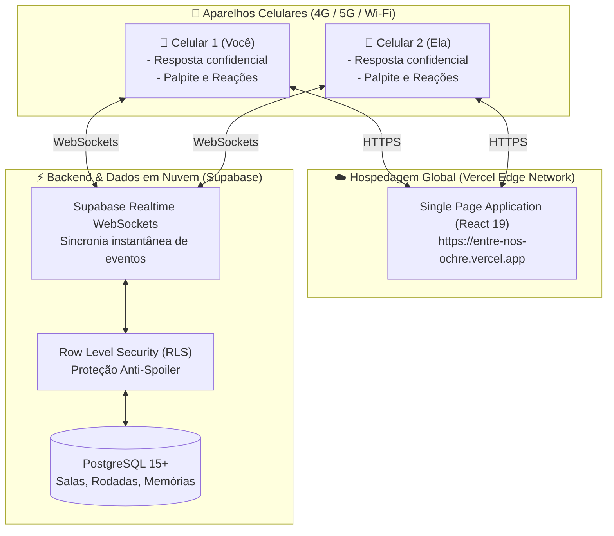

# Entre Nós 💜

> **Aplicação Web em Tempo Real para Conexão de Casais**  
> *Feito para aproximar corações — jogando simultaneamente pelo celular, mesmo à distância.*

[](https://entre-nos-ochre.vercel.app)
[](https://react.dev/)
[](https://www.typescriptlang.org/)
[](https://vitejs.dev/)
[](https://supabase.com/)
[](#-identidade-visual-e-ergonomia-mobile)

---

## 🌟 Demonstração Online

🚀 **Jogue agora em produção:** [https://entre-nos-ochre.vercel.app](https://entre-nos-ochre.vercel.app)

Abra o link no seu celular e compartilhe o código de 5 caracteres gerado (ex: `A7K92`) com a sua parceira para começarem juntas!

---

## 📖 Sobre o Projeto

O **Entre Nós** nasceu para transformar conversas a dois em uma experiência interativa, leve, romântica e memorável. Diferente de questionários estáticos de aplicativos de mensagens ou de dinâmicas que exigem passar um único telefone físico de mão em mão, o **Entre Nós permite que duas pessoas joguem ao mesmo tempo em seus próprios celulares**, seja no mesmo sofá, em casas separadas ou conectadas por 4G/5G.

### ✨ Principais Funcionalidades

- 🔄 **Dinâmica Espelhada e Simultânea (Opção B)**: Ambas jogadoras respondem e dão palpites ao mesmo tempo. As respostas ficam blindadas contra spoilers e só são mostradas na tela quando ambas concluem, em uma celebração com chuva de confetes.
- 🔓 **Avanço Livre e Flexível**: Nenhuma jogadora fica bloqueada caso a outra demore ou prefira não responder um tema íntimo. A qualquer instante é possível avançar ou pular perguntas — as respostas omitidas são registradas carinhosamente como *"Guardou para depois 👀"*.
- 💖 **Reações Afetivas de Um Toque**: Envie carinho imediato na tela de revelação com chips predefinidos (*"Amei essa resposta 🥹💜"*, *"Você me surpreendeu 🥰"*, etc.). A parceira recebe toasts flutuantes instantâneos acompanhados de corações animados.
- 📖 **Álbum Perpétuo de Memórias**: Todas as respostas reveladas são salvas de forma permanente tanto no banco relacional na nuvem quanto no dispositivo local. Ao criar uma nova sala no futuro, o histórico de memórias continua preservado para consulta e releitura.
- 🌈 **Visual Vibrante & Top Bar Neutra**: Paleta de cores acolhedora inspirada no orgulho LGBTQ+ nos cards, badges e celebrações, combinada com uma barra superior fixa (Top Bar) limpa e de alto contraste para leitura relaxante.
- 📲 **PWA (Instalação como App)**: Totalmente otimizado para navegadores mobile (iOS Safari e Android Chrome), com suporte a fixação na tela inicial sem barras de navegação.

---

## 🗂️ Catálogo de Perguntas (5 Níveis)

O jogo conta com um catálogo curado de 15 perguntas divididas em 5 níveis de intimidade progressiva:

| Nível | Categoria | Tema / Cor | Objetivo Emocional | Pergunta de Exemplo |
| :---: | :--- | :---: | :--- | :--- |
| **1** | **Começando** | 🌱 Verde | Leveza, rotina e infância | *"Qual coisa pequena melhora seu dia imediatamente?"* |
| **2** | **Me Conheça** | 💗 Rosa | Vulnerabilidade e acolhimento | *"O que faz você se sentir verdadeiramente acolhida com alguém?"* |
| **3** | **Entre Nós** | 🫶 Roxo | Sintonia e relacionamento | *"Quando percebeu que o que estava acontecendo entre a gente era especial?"* |
| **4** | **Depois das 23h** | 🌙 Azul | Desejo, química e intimidade | *"O que faz você se sentir verdadeiramente desejada por uma parceira?"* |
| **5** | **Nossa História** | 🌻 Dourado | Memórias marcantes e planos | *"Qual momento nosso você guarda com mais carinho até agora?"* |

*Cada rodada inclui ainda uma pergunta de follow-up/aprofundamento para enriquecer o diálogo pós-revelação.*

---

## 🏗️ Arquitetura e Engenharia



### 🛠️ Stack Tecnológica

- **Frontend:** React 19, TypeScript, Vite 6
- **Efeitos e UI:** Canvas Confetti, Lucide Icons, CSS Moderno com suporte a safe-area de entalhe (iPhone) e redimensionamento de teclado virtual (`interactive-widget=resizes-content`)
- **Backend & Realtime:** Supabase (PostgreSQL 15+, Triggers, RPCs transacionais e engine de WebSockets pub/sub)
- **Deploy & Infra:** Vercel com CDN Global e HTTPS automático

---

## 📁 Estrutura de Diretórios

```bash
entre-nos-web/
├── public/                     # Assets estáticos
├── src/
│   ├── components/             # Componentes reutilizáveis (ReactionBar, FloatingOverlays, etc.)
│   ├── domain/                 # Entidades e lógica de domínio (reactions, game models)
│   ├── features/               # Telas e fluxos do jogo:
│   │   ├── LobbyView.tsx       # Criação e entrada na sala por código
│   │   ├── AnsweringView.tsx   # Digitação de resposta privada
│   │   ├── GuessingView.tsx    # Palpite do que a parceira respondeu
│   │   ├── RevealView.tsx      # Revelação simultânea lado a lado
│   │   ├── MomentView.tsx      # Diálogo com pergunta de aprofundamento
│   │   └── FinishedView.tsx    # Celebração final e acesso às memórias
│   ├── hooks/                  # Hook principal useGameRoom e gerenciamento de estado
│   ├── lib/
│   │   ├── memories.ts         # Serviço de persistência do Álbum de Memórias
│   │   └── sync/               # Camada de sincronia híbrida (Supabase + Local SSE fallback)
│   ├── questions/              # Catálogo curado das 15 perguntas e follow-ups
│   ├── types/                  # Definições de tipos TypeScript
│   ├── App.tsx                 # Roteamento e orquestração do jogo
│   ├── main.tsx                # Ponto de entrada React
│   └── styles.css              # Sistema visual mobile-first e temas LGBTQ+
├── supabase/
│   └── migrations/             # Scripts SQL versionados (schema, RLS e RPCs)
├── package.json
├── tsconfig.json
├── vite.config.ts
└── README.md
```

---

## 🚀 Como Executar Localmente

### 1. Clonar o repositório
```bash
git clone https://github.com/maarirods/entre-nos.git
cd entre-nos
```

### 2. Instalar as dependências
```bash
npm install
```

### 3. Executar o servidor de desenvolvimento
```bash
npm run dev
```

Abra no navegador em `http://localhost:5173`.

> **Dica para testes locais:** Você pode abrir uma aba normal e outra em modo anônimo (ou acessar pelo IP da sua rede local no celular). O sistema possui um servidor SSE embutido que sincroniza as duas abas mesmo sem banco em nuvem configurado!

---

## 🌐 Configuração do Banco em Nuvem (Supabase)

Para habilitar a sincronização entre celulares em redes diferentes (4G/5G/Wi-Fi):

1. Crie um projeto gratuito em [Supabase](https://supabase.com).
2. Acesse o **SQL Editor** do projeto e execute o script contido em:
   [`supabase/migrations/20260909_initial_schema.sql`](supabase/migrations/20260909_initial_schema.sql)
3. No arquivo `.env` (ou nas variáveis de ambiente da Vercel), adicione:
   ```env
   VITE_SUPABASE_URL=https://seu-projeto.supabase.co
   VITE_SUPABASE_ANON_KEY=sua-chave-anon-publica
   ```

---

## 🧪 Roteiro de Homologação e Testes (QA Mobile)

Para validar a experiência entre dois smartphones reais:

| # | Caso de Teste | Descrição | Resultado Esperado |
| :-: | :--- | :--- | :--- |
| **01** | **Criação e Entrada** | Celular A cria sala e gera código de 5 dígitos. Celular B digita o código. | Celular A notifica instantaneamente a entrada e habilita o início do jogo. |
| **02** | **Resposta Simultânea** | Ambas respondem à pergunta 1 em seus aparelhos. | A parceira vê que você concluiu, mas o texto permanece 100% oculto (anti-spoiler). |
| **03** | **Palpites e Revelação** | Ambas chutam o que a outra respondeu e confirmam. | Revelação dupla automática com animação de confetes em ambas as telas. |
| **04** | **Reações Afetivas** | Toque em chips como *"Amei essa resposta 🥹💜"*. | A parceira recebe o banner com corações flutuantes em tempo real. |
| **05** | **Pular Pergunta** | Clicar em *"Pular esta pergunta ➡️"*. | O jogo avança sem bloqueios; campo omitido marcado como *"Guardou para depois 👀"*. |
| **06** | **Álbum de Memórias** | Abrir o botão *"📖 Memórias"*. | Todas as respostas reveladas aparecem organizadas e preservadas. |
| **07** | **Resiliência Mobile** | Alternar para o WhatsApp por 30s ou dar F5. | Reconexão automática na mesma sala sem perda de rodada ou respostas. |

---

## 📲 Como Instalar na Tela Inicial (PWA)

- **No iPhone (Safari):** Acesse o link, toque no ícone de **Compartilhar** (quadrado com seta para cima) e selecione **"Adicionar à Tela de Início"**.
- **No Android (Chrome):** Acesse o link, toque no menu de **3 pontinhos** no canto superior direito e selecione **"Instalar aplicativo"** ou **"Adicionar à tela inicial"**.

---

## 📄 Documentação Completa do Projeto

Para consulta e auditoria técnica detalhada:
- [Documento Word Oficial (.docx)](Entre_Nos_Documentacao_Completa_Projeto_v1.0.docx)
- [Documento Word Alternativo (.doc)](Entre_Nos_Documentacao_Completa_Projeto_v1.0.doc)

---

## 💜 Autoria & Direitos Autorais

Este projeto foi idealizado, concebido e desenhado por **Mariana Rodrigues ([@maarirods](https://github.com/maarirods))** como criadora oficial, responsável pela concepção do produto, dinâmicas afetivas, catálogo de perguntas e experiência do usuário.

- **Criadora & Idealizadora:** [Mariana Rodrigues](https://github.com/maarirods) 👩‍💻✨
- **Apoio no Desenvolvimento & Engenharia:** [Antigravity AI](https://github.com/google-deepmind) *(Google DeepMind)* 🤖💜

---

## 📜 Licença

Distribuído sob a licença **MIT**. Consulte o arquivo [`LICENSE`](LICENSE) para mais detalhes.

---

<div align="center">
  <sub>Concebido com carinho por <a href="https://github.com/maarirods"><b>Mariana Rodrigues</b></a> com apoio de <b>Antigravity AI</b> para celebrar o amor, o diálogo e a cumplicidade. 🏳️‍🌈✨</sub>
</div>

